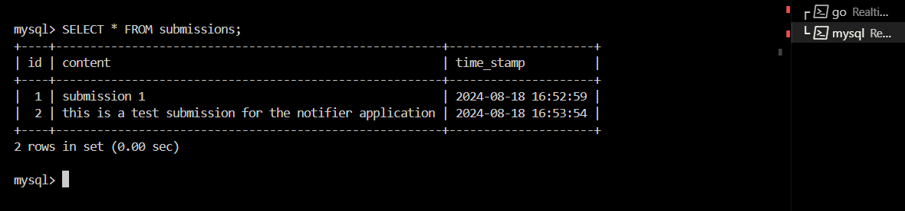

# Realtime Notification System

This project is a simple web application built in Go that allows users to submit text-based content through a web interface. The content is stored in a MySQL database. This project serves as the foundation for building more complex features such as notifications and content recommendations.

## Table of Contents

- [Project Overview](#project-overview)
- [Features](#features)
- [Project Structure](#project-structure)
- [Installation](#installation)
- [Usage](#usage)
- [API Endpoints](#api-endpoints)
- [Environment Variables](#environment-variables)
- [Database](#database)
- [Middleware](#middleware)
- [Test Output](#test-output)
- [Contributing](#contributing)
- [License](#license)

## Project Overview

The Realtime Notification System is designed to be a multi-level project where users can submit content that is stored in a MySQL database. This project is structured to be easily extensible, with future levels planned to include notification systems and content recommendations.

## Features

- Submit text-based content via a POST request.
- Store submitted content in a MySQL database.
- Simple and modular project structure, allowing for easy expansion.
- Frontend developed with React and TypeScript for user interaction.
- Middleware layer implemented to handle Cross-Origin Resource Sharing (CORS).

## Project Structure

```plaintext
Realtime-Notification-System/
├── backend_system/
│   ├── database/
│   │   └── db.go                # Handles MySQL database connection
│   ├── handlers/
│   │   └── submit.go            # Handles submission of content
│   └── server/
│       ├── main.go              # Main entry point of the backend application
│       └── mysql_schema.sql     # SQL schema for setting up the MySQL database
├── frontend_application/
│   ├── public/                  # Public assets for the React frontend
│   ├── src/
│   │   ├── App.tsx              # Main React component
│   │   ├── index.tsx            # React entry point
│   │   └── ...                  # Other React components and assets
│   ├── package.json             # Frontend dependencies and scripts
│   ├── tsconfig.json            # TypeScript configuration
│   └── ...                      # Other frontend configuration files
├── middleware_layer/
│   └── cors.go                  # Middleware for handling CORS
├── project_documentation/
│   ├── MySQL_DB_Output.png      # Screenshot of the MySQL database output
│   ├── POSTMAN_API_test.png     # Screenshot of the Postman API test
│   └── ...                      # Other project documentation files
├── .env                         # Environment variables (not included in version control)
├── .env.example                 # Example environment variables file
├── .gitignore                   # Git ignore file to exclude sensitive and unnecessary files
├── go.mod                       # Go module file
└── go.sum                       # Go checksum file for dependencies
```

## Installation

### Prerequisites

- Go (version 1.23 or later)
- Node.js and npm (for frontend)
- MySQL

### Clone the Repository

```bash
git clone https://github.com/yourusername/Realtime-Notification-System.git
cd Realtime-Notification-System
```

### Backend Setup

#### Install Dependencies

Ensure you have the required Go packages:

```bash
cd backend_system
go mod tidy
```

#### Set Up the Database

1. Start your MySQL server.
2. Create the database and table using the provided `mysql_schema.sql`:

```bash
mysql -u your_username -p realtime_notification_system < backend_system/server/mysql_schema.sql
```

### Frontend Setup

1. Navigate to the `frontend_application` directory:

```bash
cd frontend_application
```

2. Install the frontend dependencies:

```bash
npm install
```

### Set Up Environment Variables

1. Create a `.env` file in the project root by copying `.env.example`:

```bash
cp .env.example .env
```

2. Edit the `.env` file with your database credentials:

```plaintext
MYSQL_USER=your_username
MYSQL_PASSWORD=your_password
MYSQL_DB=realtime_notification_system
MYSQL_HOST=127.0.0.1
MYSQL_PORT=3306
```

### Run the Backend

```bash
cd backend_system/server
go run main.go
```

The server should start on `http://localhost:8080`.

### Run the Frontend

In a new terminal window, navigate to the `frontend_application` directory and start the React development server:

```bash
cd frontend_application
npm start
```

The frontend should start on `http://localhost:3000`.

## Usage

### Submit Content

You can submit content to the server using the frontend form, Postman, or `curl`.

#### Using `curl`

```bash
curl -X POST -d "content=This is a test submission" http://localhost:8080/submit
```

#### Using Postman

1. Create a new POST request to `http://localhost:8080/submit`.
2. Under the `Body` tab, select `x-www-form-urlencoded`.
3. Add a key-value pair:
   - Key: `content`
   - Value: `Your content here`
4. Send the request.

### View Submitted Content

You can view the submitted content in your MySQL database:

```sql
USE realtime_notification_system;
SELECT * FROM submissions;
```

## API Endpoints

- **POST /submit**: Accepts a `content` field and stores it in the database.

## Environment Variables

- `MYSQL_USER`: The MySQL username.
- `MYSQL_PASSWORD`: The MySQL password.
- `MYSQL_DB`: The name of the MySQL database.
- `MYSQL_HOST`: The MySQL server host (e.g., `127.0.0.1`).
- `MYSQL_PORT`: The MySQL server port (default is `3306`).

## Database

The project uses MySQL to store submitted content. The `submissions` table has the following schema:

```sql
CREATE TABLE submissions (
    id INT AUTO_INCREMENT PRIMARY KEY,
    content TEXT NOT NULL,
    time_stamp TIMESTAMP DEFAULT CURRENT_TIMESTAMP
);
```

## Middleware

The project includes a middleware layer to handle Cross-Origin Resource Sharing (CORS). This is necessary when the frontend and backend are running on different origins (e.g., different ports or domains). The CORS middleware allows the frontend to make requests to the backend without encountering cross-origin errors.

### CORS Middleware Implementation

The CORS middleware is implemented in `middleware_layer/cors.go` and is applied to the routes in the backend.

```go
package middleware

import (
 "net/http"
)

// EnableCORS is a middleware that handles Cross-Origin Resource Sharing (CORS)
func EnableCORS(next http.Handler) http.Handler {
 return http.HandlerFunc(func(w http.ResponseWriter, r *http.Request) {
  w.Header().Set("Access-Control-Allow-Origin", "http://localhost:3000")
  w.Header().Set("Access-Control-Allow-Methods", "GET, POST, PUT, DELETE, OPTIONS")
  w.Header().Set("Access-Control-Allow-Headers", "Content-Type, Authorization")

  // Handle preflight requests
  if r.Method == "OPTIONS" {
   return
  }

  next.ServeHTTP(w, r)
 })
}
```

This middleware is crucial for allowing the frontend, typically running on `http://localhost:3000`, to interact with the backend on `http://localhost:8080` during development.

## Test Output

This section provides evidence that the system works as intended by showcasing the results of testing the `/submit` endpoint.

### Postman Content Submission

Here is a screenshot of a POST request made in Postman to the `/submit` endpoint, with the content being successfully submitted:


### MySQL Database Content

Here is a screenshot of the MySQL database showing the submitted content stored in the `submissions` table:



## Contributing

Contributions are welcome! Please fork the repository and submit a pull request.
