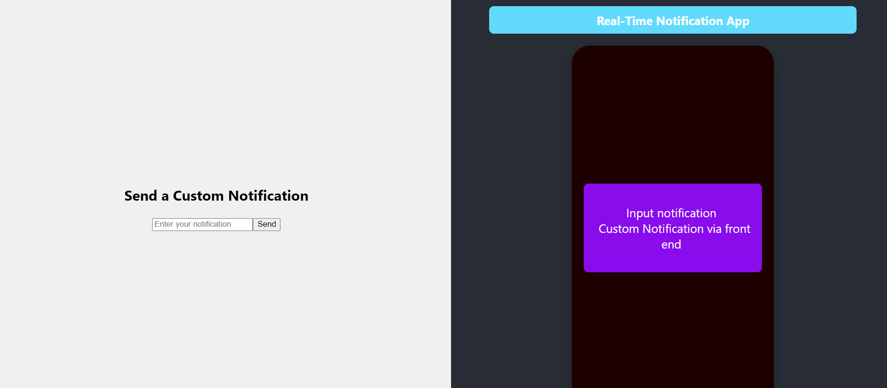
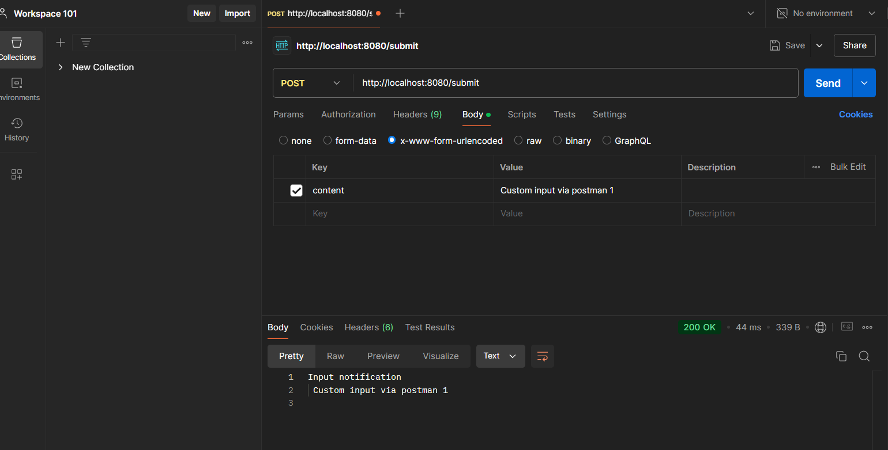
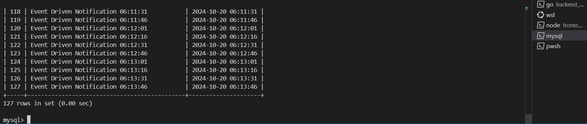
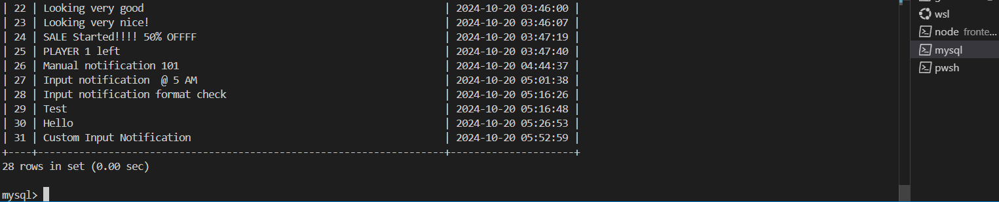

# **Realtime Notification System**

This project is a **real-time web application** built in **Go** with a **React frontend**. It allows users to **submit content** through a form and uses **Redis Pub/Sub** and **WebSocket** for real-time notifications. Submitted content is stored in a **MySQL database**.

The system supports both **user notifications** via user input and **clock-based events** to simulate real-time triggers.

---

## **Table of Contents**

- [Project Overview](#project-overview)
- [Features](#features)
- [Real-World Applications](#real-world-applications)
- [Project Structure](#project-structure)
- [Installation](#installation)
- [Usage](#usage)
- [API Endpoints](#api-endpoints)
- [Environment Variables](#environment-variables)
- [Database](#database)
- [Middleware](#middleware)
- [Test Output](#test-output)
- [Contributing](#contributing)
- [License](#license)

---

## **Project Overview**

The **Realtime Notification System** integrates a **Go backend**, **Redis-based event-driven notifications**, and a **React frontend**. It allows:

- **user notifications** through user input via the **custom notification input panel** on the frontend.
- **Clock-based events** to simulate real-time notifications.
- **WebSocket connections** for instant updates to the frontend.

### **Frontend UI Example:**

  


---

## **Features**

- Submit text-based content via the **frontend input panel** or a POST request.
- Store submitted content in a MySQL database.
- **Redis Pub/Sub** for event-driven notifications.
- **WebSocket integration** for real-time updates.
- **Clock-based events** to simulate real-time triggers.
- Frontend built with **React and TypeScript**.
- Middleware for handling **CORS** between backend and frontend.

---

## **Real-World Applications**

This notification system has a wide range of real-world applications across multiple industries. Below are some **key use cases**:

1. **News and Media Platforms**  
   Real-time notifications deliver **breaking news updates** and **content recommendations** to boost user engagement and increase ad revenue through **prompt content delivery**.

2. **FinTech Platforms**  
   Financial services platforms notify users of **price alerts, transaction updates, and market news**, helping them stay ahead in investments and manage risks in real-time. Notifications also **facilitate smoother financial transactions** and alerts for **payment failures** or **account activities**.

3. **Gaming Platforms and Monetization Strategies**  
   Online gaming platforms rely heavily on notifications to promote **live events, leaderboard updates**, and **time-sensitive offers**. They use real-time alerts to boost **user retention and monetization** through **in-app purchases, reward claims, and exclusive event notifications**.

4. **E-Commerce Platforms**  
   E-commerce platforms send **order status updates**, alerts for **promotions**, and **stock availability notifications**, driving higher sales and improving customer satisfaction.

5. **Social Media and Messaging Apps**  
   Social media platforms like WhatsApp, Twitter, and Instagram use notifications to inform users about **mentions, direct messages, new followers**, and **likes**, keeping the user base engaged.

6. **IoT and Monitoring Systems**  
   IoT devices send real-time alerts for **system anomalies, motion detection**, or **temperature changes**, enabling quick responses and safety measures. Industrial IoT systems use notifications to flag **equipment failures** and **maintenance needs**.

7. **Healthcare Systems**  
   Hospitals and clinics notify patients with **appointment reminders**, **lab results**, or **prescription updates**, reducing missed appointments and enhancing patient engagement.

8. **Event and Calendar Management Systems**  
   Users receive reminders for **upcoming meetings, events**, and **webinars**, ensuring better participation and time management.

---

## **Project Structure**

```plaintext
Realtime-Notification-System/
├── backend_system/
│   ├── database/
│   │   └── db.go                # MySQL database connection
│   ├── handlers/
│   │   ├── submit.go            # Handles content submission
│   │   ├── web_socket.go        # WebSocket handler for notifications
│   │   └── clock_event.go       # Publishes notifications via Redis
│   └── server/
│       ├── router.go            # Configures routes and WebSocket handling
│       ├── main.go              # Entry point of the backend
│       └── mysql_schema.sql     # SQL schema for MySQL setup
├── frontend_application/
│   ├── public/                  # Public assets for React frontend
│   ├── src/
│   │   ├── App.tsx              # Main React component
│   │   ├── index.tsx            # React entry point
│   └── ...                      # Other React components and assets
├── middleware_layer/
│   └── cors.go                  # CORS middleware
├── .env                         # Environment variables (excluded from version control)
├── .env.example                 # Example environment variables file
├── go.mod                       # Go module dependencies
├── go.sum                       # Checksum file for Go dependencies
```

---

## **Installation**

### **Prerequisites**

- Go (v1.23 or later)
- Node.js and npm (for frontend)
- Redis Server
- MySQL Server

### **Clone the Repository**

```bash
git clone https://github.com/yourusername/Realtime-Notification-System.git
cd Realtime-Notification-System
```

---

### **Backend Setup**

1. **Install Go Dependencies:**

   ```bash
   cd backend_system
   go mod tidy
   ```

2. **Set Up MySQL Database:**

   ```bash
   mysql -u your_username -p realtime_notification_system < backend_system/server/mysql_schema.sql
   ```

3. **Run Redis Server:**

   ```bash
   redis-server
   ```

---

### **Frontend Setup**

1. **Navigate to Frontend Directory:**

   ```bash
   cd frontend_application
   ```

2. **Install Frontend Dependencies:**

   ```bash
   npm install
   ```

---

### **Set Up Environment Variables**

1. **Copy `.env.example` to `.env`:**

   ```bash
   cp .env.example .env
   ```

2. **Update Database Credentials in `.env`:**

   ```plaintext
   MYSQL_USER=your_username
   MYSQL_PASSWORD=your_password
   MYSQL_DB=realtime_notification_system
   MYSQL_HOST=127.0.0.1
   MYSQL_PORT=3306
   ```

---

### **Run the Backend**

```bash
cd backend_system/server
go run main.go
```

---

### **Run the Frontend**

```bash
cd frontend_application
npm start
```

---

## **Usage**

### **User Notification Submission**

Submit content via the frontend **custom notification input panel** or using Postman:

```bash
curl -X POST -d "content=Manual Notification" http://localhost:8080/submit
```

---

### **Clock-Based Event-Driven Notifications**

Every minute, a **clock-based event** publishes a notification via Redis to simulate real-time events.

---

### **API Endpoints**

- **POST /submit**: Submits content to the database and triggers a manual notification.
- **WebSocket /ws**: Listens for real-time notifications from Redis.

---

## **Database**

The **MySQL database** stores submitted content using the following schema:

```sql
CREATE TABLE submissions (
    id INT AUTO_INCREMENT PRIMARY KEY,
    content TEXT NOT NULL,
    time_stamp TIMESTAMP DEFAULT CURRENT_TIMESTAMP
);
```

---

## **Middleware**

The **CORS middleware** allows the frontend to communicate with the backend. It is implemented in `middleware_layer/cors.go` and applied to backend routes.

---

## **Test Output**

1. **User Notification Submission (Front End):**

    

1. **User Notification Submission (Postman):**

     
   

2. **Database Content View (Event Driven Notifications):**

     
   

2. **Database Content View (User Notifications):**

     
   

---

## **Contributing**

Contributions are welcome! Fork the repository and submit a pull request.

---
