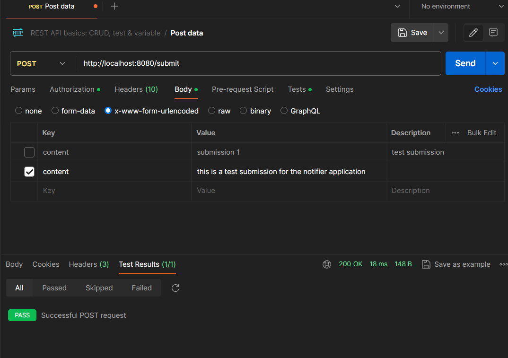

# Realtime Notification System

This project is a simple web application built in Go that allows users to submit text-based content through a web interface. The content is stored in a MySQL database. This project serves as the foundation for building more complex features such as notifications and content recommendations.

## Table of Contents

- [Project Overview](#project-overview)
- [Features](#features)
- [Project Structure](#project-structure)
- [Installation](#installation)
- [Usage](#usage)
- [API Endpoints](#api-endpoints)
- [Environment Variables](#environment-variables)
- [Database](#database)
- [Test Output](#test-output)
- [Contributing](#contributing)
- [License](#license)

## Project Overview

The Realtime Notification System is designed to be a multi-level project where users can submit content that is stored in a MySQL database. This project is structured to be easily extensible, with future levels planned to include notification systems and content recommendations.

## Features

- Submit text-based content via a POST request.
- Store submitted content in a MySQL database.
- Simple and modular project structure, allowing for easy expansion.

## Project Structure

```plaintext
Realtime-Notification-System/
├── database/
│   └── db.go              # Handles MySQL database connection
├── handlers/
│   └── submit.go          # Handles submission of content
├── server/
│   └── router.go          # Sets up the HTTP server and routes
├── .env                   # Environment variables (not included in version control)
├── .env.example           # Example environment variables file
├── .gitignore             # Git ignore file to exclude sensitive and unnecessary files
├── go.mod                 # Go module file
├── go.sum                 # Go checksum file for dependencies
└── main.go                # Main entry point of the application
```

## Installation

### Prerequisites

- Go (version 1.23 or later)
- MySQL

### Clone the Repository

```bash
git clone https://github.com/yourusername/Realtime-Notification-System.git
cd Realtime-Notification-System
```

### Install Dependencies

Ensure you have the required Go packages:

```bash
go mod tidy
```

### Set Up the Database

1. Start your MySQL server.
2. Create the database and table:

```sql
CREATE DATABASE IF NOT EXISTS realtime_notification_system;

USE realtime_notification_system;

CREATE TABLE IF NOT EXISTS submissions (
    id INT AUTO_INCREMENT PRIMARY KEY,
    content TEXT NOT NULL,
    time_stamp TIMESTAMP DEFAULT CURRENT_TIMESTAMP
);
```

### Set Up Environment Variables

1. Create a `.env` file in the project root by copying `.env.example`:

```bash
cp .env.example .env
```

2. Edit the `.env` file with your database credentials:

```plaintext
MYSQL_USER=your_username
MYSQL_PASSWORD=your_password
MYSQL_DB=realtime_notification_system
MYSQL_HOST=127.0.0.1
MYSQL_PORT=3306
```

### Run the Application

```bash
go run main.go
```

The server should start on `http://localhost:8080`.

## Usage

### Submit Content

You can submit content to the server using Postman, `curl`, or an HTML form.

#### Using `curl`

```bash
curl -X POST -d "content=This is a test submission" http://localhost:8080/submit
```

#### Using Postman

1. Create a new POST request to `http://localhost:8080/submit`.
2. Under the `Body` tab, select `x-www-form-urlencoded`.
3. Add a key-value pair:
   - Key: `content`
   - Value: `Your content here`
4. Send the request.

### View Submitted Content

You can view the submitted content in your MySQL database:

```sql
USE realtime_notification_system;
SELECT * FROM submissions;
```

## API Endpoints

- **POST /submit**: Accepts a `content` field and stores it in the database.

## Environment Variables

- `MYSQL_USER`: The MySQL username.
- `MYSQL_PASSWORD`: The MySQL password.
- `MYSQL_DB`: The name of the MySQL database.
- `MYSQL_HOST`: The MySQL server host (e.g., `127.0.0.1`).
- `MYSQL_PORT`: The MySQL server port (default is `3306`).

## Database

The project uses MySQL to store submitted content. The `submissions` table has the following schema:

```sql
CREATE TABLE submissions (
    id INT AUTO_INCREMENT PRIMARY KEY,
    content TEXT NOT NULL,
    time_stamp TIMESTAMP DEFAULT CURRENT_TIMESTAMP
);
```

## Test Output

This section provides evidence that the system works as intended by showcasing the results of testing the `/submit` endpoint.

### Postman Content Submission

Here is a screenshot of a POST request made in Postman to the `/submit` endpoint, with the content being successfully submitted:



### MySQL Database Content

Here is a screenshot of the MySQL database showing the submitted content stored in the `submissions` table:


## Contributing

Contributions are welcome! Please fork the repository and submit a pull request.

## License

This project is licensed under the MIT License.
